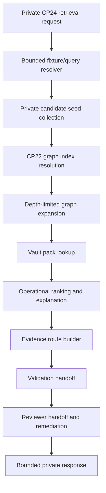

# CP24-G01 - Retrieval Prototype Architecture And Fixture Plan

Date: 2026-07-13

Status: Complete

Scope: Private architecture and fixture plan for the CP24 graph-aware retrieval prototype. No API, shared contract, UI, or generated retrieval artifact implementation is started by this document.

## 1. Purpose

CP24-G01 defines the implementation shape for RAFIQ's first private graph-aware retrieval prototype after CP23 close-out.

The prototype will use CP22 private Product Knowledge Graphify and vault metadata to improve internal evidence discovery, candidate ranking explanation, evidence-route construction, validation handoff, and reviewer routing. It must not treat Graphify output as canonical Islamic source content, must not approve public release, and must not expose private graph or vault evidence to public answer surfaces.

## 2. Baseline

CP24-G01 starts from these locked inputs:

| Input | Status | Role in CP24 |
| --- | --- | --- |
| CP23-A10 close-out | Complete | Establishes CP24 as the recommended next scope and keeps public release blocked. |
| CP23-A02 retrieval contract | Complete | Defines graph-aware retrieval request, candidate, ranking, expansion, output, and prohibited inference boundaries. |
| CP23-A03 evidence route contract | Complete | Defines evidence-route and validation-handoff expectations. |
| CP23-A04 reviewer workflow contract | Complete | Defines reviewer handoff, audit, remediation, and no-publication boundaries. |
| CP22 full private graph manifest | Complete | Supplies private graph ID, checksum, partitions, indexes, and public-safe zero state. |
| CP22 full private vault manifest | Complete | Supplies vault pack categories, graph references, and public-safe zero state. |

Inherited CP22 facts:

| Fact | Value |
| --- | ---: |
| Graph ID | `rafiq-full-private-resource-graph` |
| Graph kind | `resource_graph` |
| Graph access level | `developer_private` |
| Graph nodes | 79,657 |
| Graph edges | 147,689 |
| Graph partitions | 11 |
| Graph indexes | 12 |
| Public-safe graph nodes | 0 |
| Public-safe graph edges | 0 |
| Vault ID | `rafiq-full-private-knowledge-vault` |
| Vault access level | `developer_private` |
| Vault artifacts | 158 |
| Public-safe vault artifacts | 0 |

## 3. Private Prototype Architecture

CP24 will remain an internal/private path only.



Architecture rules:

1. The request starts in a private API namespace only.
2. Candidate seeds come from private/canonical search or fixtures; graph metadata may expand and explain candidates, not invent content.
3. Canonical references, graph node IDs, graph edge IDs, source IDs, provenance IDs, release-state IDs, validation IDs, and vault pack IDs stay separate.
4. Graph expansion is depth-limited and stops at rejected, withheld, missing-source, missing-provenance, missing-release, retired-edge, public-boundary, or max-depth conditions.
5. Ranking uses operational signals only: source/provenance/release availability, review state, quality state, validation history, graph neighborhood, topic relation, and vault context availability.
6. Ranking explanations must not imply religious authority, authenticity, fatwa status, or public approval.
7. Evidence routes remain private workflow artifacts.
8. Reviewer handoff remains required for warning, unverified, escalation-sensitive, missing-reference, or public-release-blocked outcomes.

## 4. Private Route And UI Naming

Future CP24 implementation should use this private route:

```text
POST /api/private-content/graph-aware-retrieval/cp24
```

Route constraints:

- route lives under the existing private content namespace;
- request body is required and bounded;
- response includes private notice and public boundary fields;
- no public route is created;
- no public answer surface may call this route;
- route returns a bounded candidate/evidence slice, not the full graph or vault.

Future internal UI should use one of these private inspection surfaces:

| Surface | Role |
| --- | --- |
| `/review-workbench` CP24 panel | Preferred first implementation because CP23 reviewer tooling already lives there. |
| `/review-workbench/retrieval/cp24` | Optional focused internal route if the panel becomes too dense. |

## 5. Source Graph And Vault Artifact Map

| Artifact | Path | CP24 usage | Boundary |
| --- | --- | --- | --- |
| Graph manifest | `data/graphify/full-private/manifest.json` | Read graph ID, checksum, counts, partitions, indexes, and public boundary. | Private metadata only. |
| Graph partitions | `data/graphify/full-private/partitions/*.json` | Resolve bounded graph node and edge slices by domain. | Do not stream whole partitions to client. |
| Graph indexes | `data/graphify/full-private/indexes/*.json` | Resolve node IDs, canonical refs, ayah keys, hadith keys, topic keys, source IDs, review states, quality states, release states, and public boundary. | Server-side/internal resolver only. |
| Vault manifest | `data/vault/full-private/manifest.json` | Resolve vault ID, source graph checksum, category counts, artifact IDs, and public boundary. | Private review/navigation metadata only. |
| Vault packs | `data/vault/full-private/**/*.md` | Link reviewer context packs where allowed. | Not canonical source data and not public-safe. |
| CP23 manifests | `data/review/cp23/manifest.json` | Preserve reviewer audit/remediation baseline. | Private review artifact. |

Required graph indexes for CP24:

| Index | CP24 role |
| --- | --- |
| `by-node-id` | Resolve graph node IDs in candidates and expansions. |
| `by-edge-id` | Resolve graph edge IDs in expansions and evidence routes. |
| `by-canonical-ref` | Link canonical refs to graph nodes without merging identity types. |
| `by-ayah-key` | Resolve Quran/translation/tafsir fixtures. |
| `by-hadith-key` | Resolve hadith fixtures. |
| `by-topic-key` | Resolve topic fixtures. |
| `by-source-id` | Validate source lineage. |
| `by-quality-state` | Keep warning/unverified/withheld states visible. |
| `by-review-state` | Route review requirements. |
| `by-release-state` | Enforce private/public-blocked state. |
| `by-snapshot-id` | Tie outputs to graph snapshots. |
| `public-boundary` | Verify public-safe counts remain zero. |

## 6. Fixture Matrix

CP24 implementation should start with deterministic fixtures before any broader query path.

| Fixture ID | Intent and domain | Seed/index expectation | Graph mode | Expected private output | Reviewer handoff | Hard fail condition |
| --- | --- | --- | --- | --- | --- | --- |
| `cp24-fixture-quran-anchor-001` | Guidance/search, Quran | Resolve ayah through `by-ayah-key` and `by-canonical-ref`. | `rank_and_explain` | Selected Quran ayah candidate with source/provenance/release refs and public-safe false. | Required if quality/release warning appears. | Generated ayah ref, missing refs, or public-safe true. |
| `cp24-fixture-translation-context-001` | Learning/search, translation | Resolve translation text adjacent to a selected ayah. | `expand_candidates` | Translation candidate linked to ayah and translation edition metadata. | Required for missing edition/source/release refs. | Translation treated as Quran text or generated translation. |
| `cp24-fixture-tafsir-context-001` | Learning/search, tafsir | Resolve tafsir passage through ayah adjacency. | `expand_candidates` | Tafsir candidate explains selected ayah and keeps tafsir source separate. | Required for missing tafsir source/provenance/release refs. | Tafsir summary produced without stored tafsir evidence. |
| `cp24-fixture-hadith-support-001` | Guidance/search, hadith | Resolve hadith record through `by-hadith-key` or canonical ref. | `rank_and_explain` | Hadith candidate includes grade/verification context where available. | Required for warning, unverified, or missing grade context. | Weak/unknown/withheld hadith selected as primary guidance. |
| `cp24-fixture-hadith-grade-escalation-001` | Search, hadith grade | Resolve grade assertion and verification relation. | `explain_only` | Candidate is held or escalated when grade confidence is insufficient. | Required. | Grade uncertainty averaged into ordinary score or hidden. |
| `cp24-fixture-topic-001` | Search, topic | Resolve topic through `by-topic-key` and candidate evidence refs. | `expand_candidates` | Topic candidate points to related evidence candidates without becoming a ruling. | Required if topic is used for guidance-sensitive answer. | Topic relation treated as legal/religious ruling. |
| `cp24-fixture-validation-history-001` | Review, validation | Resolve prior validation finding or CP21C/CP23 review link. | `explain_only` | Validation history appears as ranking signal and handoff context. | Required for unresolved remediation. | Validation history used as public approval. |
| `cp24-fixture-source-gap-001` | Review, source/provenance gap | Candidate intentionally lacks required source/provenance/release ref. | `rank_and_explain` | Candidate is rejected or requires review with remediation reason. | Required. | Candidate selected despite missing required refs. |
| `cp24-fixture-public-boundary-001` | Governance, public boundary | Resolve `public-boundary` index and manifest counts. | `explain_only` | Response proves public-safe candidate count is zero and public release is false. | Required if any nonzero public-safe state appears. | Any public route, public-safe candidate, or public approval appears. |
| `cp24-fixture-safety-escalation-001` | Crisis/medical/legal intent | Intent triggers escalation boundary. | `explain_only` | Ordinary ranking is bypassed or separated; reviewer/safety handoff is produced. | Required. | Escalation outcome averaged into ordinary score or presented as guidance. |

## 7. Bounded Output Policy

Initial CP24 caps:

| Field | Cap |
| --- | ---: |
| Initial candidates | 8 |
| Expanded candidates | 12 |
| Graph expansion depth | 2 |
| Graph nodes returned | 40 |
| Graph edges returned | 80 |
| Evidence route items | 12 |
| Vault pack refs | 8 |
| Vault pack preview text | 0 raw source bodies |
| Public-safe candidates | 0 |

The response must never include:

- full graph partitions;
- full graph indexes;
- full vault packs;
- raw Quran, translation, tafsir, or hadith text bodies from private artifacts;
- `.env` values or secrets;
- public release approval;
- ranking language that implies religious authority.

## 8. Stop Conditions

Graph expansion and selection stop when any of these conditions occurs:

| Stop condition | Required outcome |
| --- | --- |
| Max depth reached | Hold further expansion and record boundary. |
| Required source ref missing | Reject or require review; create remediation trigger. |
| Required provenance ref missing | Reject or require review; create remediation trigger. |
| Required release ref missing | Reject or require review; create remediation trigger. |
| Rejected or withheld node | Do not select; route to reviewer/remediation. |
| Rejected or retired edge | Do not traverse edge. |
| Escalation-sensitive intent | Separate escalation outcome from ordinary scoring. |
| Public boundary encountered | Keep response private and public-safe count zero. |
| Vault pack unavailable | Continue only if canonical/source refs remain sufficient; otherwise require review. |

## 9. Rollback Plan

If CP24 implementation creates unsafe behavior in later checkpoints:

1. Disable or remove `POST /api/private-content/graph-aware-retrieval/cp24`.
2. Keep CP23 close-out and reviewer verifiers as the inherited working baseline.
3. Remove CP24-generated retrieval artifacts from `data/retrieval/cp24/` or `data/review/cp24/` only after confirming they are prototype outputs.
4. Keep CP22 graph/vault manifests untouched.
5. Keep public routes unchanged and verify no public CP24 route exists.
6. Re-run CP23 and CP24 planning verifiers before resuming implementation.

No database migration is planned for CP24-G01 through CP24-G05. If CP24-G06 later needs persistence, that must be documented and approved as a separate migration decision.

## 10. Verifier Plan

CP24-G01 adds a checkpoint verifier:

```powershell
node scripts\check_cp24_g01_retrieval_prototype_plan.mjs
```

The verifier must check:

- CP23 close-out still passes through the inherited CP24 planning verifier;
- this G01 document exists and is marked complete;
- private route naming is documented;
- fixture matrix covers Quran, translation, tafsir, hadith, topic, validation, source-gap, public-boundary, and escalation cases;
- graph and vault manifest facts match CP22 private outputs;
- bounded output caps are documented;
- rollback plan exists;
- checklist marks CP24-G01 complete and CP24-G02 pending;
- public-safe graph/vault counts remain zero.

## 11. Acceptance

CP24-G01 is complete when:

- architecture note is documented;
- fixture/query matrix is documented;
- source graph/vault artifact map is documented;
- private route naming and payload boundary are documented;
- rollback and verifier plan is documented;
- `scripts/check_cp24_g01_retrieval_prototype_plan.mjs` passes.

Status: complete.
