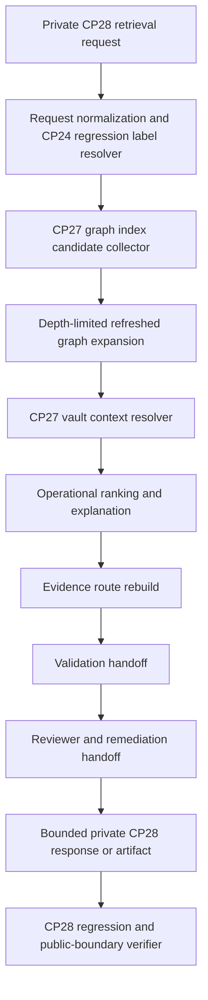

# CP28-R01 - Retrieval Architecture From Refreshed Graph/Vault

Date: 2026-07-17

Status: Complete

Scope: Architecture and fixture migration plan for integrating graph-aware retrieval with CP27 refreshed graph/vault outputs. No API, shared contract, UI, or generated retrieval artifact implementation is started by this document.

## 1. Purpose

CP28-R01 defines how RAFIQ will move from the CP24 static graph-aware retrieval prototype to retrieval backed by CP27 refreshed graph and vault outputs.

CP24 proved the retrieval shape: request, candidate expansion, ranking, evidence route, validation handoff, reviewer handoff, private API, and internal UI. CP27 proved the refreshed graph/vault layer from CP26 snapshot-derived artifacts. CP28 connects those two lines of work.

For avoidance of doubt: canonical Quran, tafsir, translation, hadith, grade, verification, guidance, provenance, release-state, and review data remain authoritative. CP28 graph/vault retrieval artifacts are private derived metadata only.

CP28-R01 is architecture-only. It does not claim that CP28 retrieval artifacts, API behavior, or UI behavior are implemented.

## 2. Controlling Baselines

| Baseline | Evidence | Role in CP28 |
| --- | --- | --- |
| CP27 close-out | `CP27_G07_COMBINED_VERIFICATION_AND_CLOSE_OUT.md`; `data/graphify/cp27-refresh/latest-verification.json` | Controlling refreshed graph/vault baseline. |
| CP27 refreshed graph | `data/graphify/cp27-refresh/latest-graph.json` | Source graph pointer for CP28 candidate collection and expansion. |
| CP27 refreshed vault | `data/vault/cp27-refresh/latest-vault.json` | Vault pointer for CP28 vault context and reviewer handoff. |
| CP24 close-out | `CP24_G09_CLOSE_OUT_AND_NEXT_SCOPE_DECISION.md` | Regression baseline for request/response shape and expected fixture behavior. |
| CP24 retrieval manifest | `data/retrieval/cp24/manifest.json` | Fixture and artifact comparison baseline only. |
| CP23 contracts | `CP23_A02_GRAPH_AWARE_RETRIEVAL_CONTRACT.md`; `CP23_A03_EVIDENCE_ROUTE_AND_VALIDATION_CONTRACT.md`; `CP23_A04_REVIEWER_WORKFLOW_CONTRACT.md` | Retrieval, evidence route, validation, and reviewer workflow rules. |

## 3. Current Baseline Counts

| Area | Count |
| --- | ---: |
| CP24 fixtures | 10 |
| CP24 candidates | 87 |
| CP24 selected candidates | 15 |
| CP24 evidence routes | 10 |
| CP24 remediation items | 72 |
| CP24 high/critical remediation items | 18 |
| CP24 public-safe candidates | 0 |
| CP24 public-safe route items | 0 |
| CP27 graph nodes | 147 |
| CP27 graph edges | 125 |
| CP27 graph partitions | 10 |
| CP27 graph indexes | 12 |
| CP27 vault artifacts | 26 |
| CP27 vault categories | 4 |
| CP27 unresolved references | 77 |
| CP27 high/critical blockers | 30 |
| CP27 public-safe graph nodes | 0 |
| CP27 public-safe graph edges | 0 |
| CP27 public-safe vault artifacts | 0 |

## 4. Target Architecture



Architecture rules:

1. The request remains private-only.
2. CP24 fixture IDs become regression labels and query seeds, not the final source graph.
3. CP27 graph indexes and summaries become the refreshed graph source for candidate collection.
4. CP27 vault packs become private reviewer context only.
5. Candidate collection may use canonical refs, graph node IDs, source IDs, topic keys, ayah keys, hadith keys, review states, quality states, and release states as operational metadata.
6. Candidate selection must still require source/provenance/release visibility where applicable.
7. Ranking explanations remain operational and must not imply religious authority, authenticity, fatwa status, or public approval.
8. Escalation-sensitive cases remain separate from ordinary scoring.
9. Public-safe counts remain zero.

## 5. CP24 To CP28 Migration Map

| CP24 component | CP24 source | CP28 replacement | Migration rule |
| --- | --- | --- | --- |
| Retrieval manifest | `data/retrieval/cp24/manifest.json` | `data/retrieval/cp28/manifest.json` | CP28 manifest must identify CP27 graph/vault pointers and retain CP24 regression refs. |
| Candidate expansion | `data/retrieval/cp24/candidate-expansion.json` | `data/retrieval/cp28/candidate-expansion.json` | Candidate seeds are rebuilt from CP27 indexes; CP24 candidate IDs become regression comparison IDs. |
| Ranking selection | `data/retrieval/cp24/ranking-selection.json` | `data/retrieval/cp28/ranking-selection.json` | Ranking uses same allowed signal families but refreshed graph/vault refs. |
| Validation handoff | `data/retrieval/cp24/validation-handoff.json` | `data/retrieval/cp28/validation-handoff.json` | Evidence routes are rebuilt from refreshed candidates and preserve validation gate states. |
| Private API | `POST /api/private-content/graph-aware-retrieval/cp24` | planned `POST /api/private-content/graph-aware-retrieval/cp28` | CP28 route is private-only and may be added in CP28-R05. |
| Internal UI | `/graph-aware-retrieval` CP24 view | `/graph-aware-retrieval` CP28 mode or focused panel | UI may show CP24/CP28 comparison but must remain private and bounded. |
| Graph proof | CP22 graph ID/checksum | CP27 graph ID/checksum | Response proof must show CP27 source graph and CP24 regression baseline separately. |
| Vault proof | CP22 vault ID | CP27 vault ID | Vault refs remain reviewer context only and not canonical source content. |

## 6. CP27 Graph/Vault Artifact Map

| Artifact | Path | CP28 usage | Boundary |
| --- | --- | --- | --- |
| Latest CP27 verification | `data/graphify/cp27-refresh/latest-verification.json` | Confirm CP27 close-out and public-boundary baseline. | Read-only private proof. |
| Latest graph pointer | `data/graphify/cp27-refresh/latest-graph.json` | Resolve graph manifest, summary, checksum ledger, and counts. | Do not send full graph to client. |
| Graph manifest | `data/graphify/cp27-refresh/graph/cp27-g03-refresh-graph/manifest.json` | Identify graph ID, partitions, indexes, source snapshot, and public boundary. | Derived private metadata. |
| Graph summary | `data/graphify/cp27-refresh/graph/cp27-g03-refresh-graph/summary.json` | Use partition/index summaries for planning and bounded proof. | Summary-only client payload allowed. |
| Graph partitions | `data/graphify/cp27-refresh/graph/cp27-g03-refresh-graph/partitions/*.json` | Server-side candidate and expansion lookup in CP28-R02. | Do not stream whole partitions. |
| Graph indexes | `data/graphify/cp27-refresh/graph/cp27-g03-refresh-graph/indexes/*.json` | Candidate seed, canonical ref, source, quality, review, release, topic, ayah, hadith, and public-boundary lookup. | Server-side/private resolver only. |
| Latest vault pointer | `data/vault/cp27-refresh/latest-vault.json` | Resolve vault manifest, summary, checksum ledger, and counts. | Do not send vault Markdown bodies. |
| Vault manifest | `data/vault/cp27-refresh/vault/cp27-g04-refresh-vault/manifest.json` | Resolve vault artifact IDs, categories, graph node refs, and public boundary. | Reviewer context only. |
| Vault packs | `data/vault/cp27-refresh/vault/cp27-g04-refresh-vault/packs/**/*.md` | Private reviewer context in CP28-R04/R05 if selected. | Not canonical content; not public-safe. |

Required CP27 graph indexes for CP28:

| Index | CP28 role |
| --- | --- |
| `by-node-id` | Resolve refreshed graph nodes in candidates and expansion. |
| `by-edge-id` | Resolve refreshed graph edges used by route items. |
| `by-canonical-ref` | Link canonical refs to graph nodes without merging identity types. |
| `by-ayah-key` | Resolve Quran/translation/tafsir query seeds where available. |
| `by-hadith-key` | Resolve hadith query seeds where available. |
| `by-topic-key` | Resolve topic query seeds where available. |
| `by-source-id` | Validate source lineage. |
| `by-quality-state` | Keep warning/unverified/withheld states visible. |
| `by-review-state` | Route review requirements. |
| `by-release-state` | Enforce private/public-blocked state. |
| `by-snapshot-id` | Tie retrieval outputs to CP26/CP27 snapshot lineage. |
| `public-boundary` | Verify public-safe counts remain zero. |

## 7. Refreshed Fixture Matrix

CP28 keeps CP24 fixture intent coverage but rebinds each fixture to CP27 refreshed graph/vault metadata.

| Fixture ID | CP28 refreshed source expectation | Expected outcome | Hard fail condition |
| --- | --- | --- | --- |
| `cp28-fixture-quran-anchor-001` | Resolve Quran seed through CP27 `by-ayah-key` or canonical ref indexes. | Quran candidate can be selected only with visible source/provenance/release state. | Generated ayah ref, missing refs hidden, or public-safe true. |
| `cp28-fixture-translation-context-001` | Resolve translation context through CP27 canonical/ayah/source links. | Translation remains separate from Quran text and routes to validation if source/release is incomplete. | Translation treated as Quran text or generated translation. |
| `cp28-fixture-tafsir-context-001` | Resolve tafsir context through refreshed ayah adjacency and source lineage. | Tafsir candidate remains explanatory context, not a ruling. | Tafsir summary produced without stored tafsir evidence. |
| `cp28-fixture-hadith-support-001` | Resolve hadith support through CP27 `by-hadith-key` or canonical refs. | Hadith candidate includes visible grade/verification/review state where available. | Weak/unknown/withheld hadith selected as primary guidance. |
| `cp28-fixture-hadith-grade-escalation-001` | Resolve hadith grade/quality nodes and blockers from CP27 graph. | Candidate is held or escalated when confidence is insufficient. | Grade uncertainty averaged into ordinary score or hidden. |
| `cp28-fixture-topic-001` | Resolve topic through CP27 `by-topic-key` and related evidence refs. | Topic may expand evidence candidates but cannot become a ruling. | Topic relation treated as religious/legal authority. |
| `cp28-fixture-validation-history-001` | Resolve validation/review metadata from CP27 quality/review partitions. | Validation history affects operational ranking and reviewer handoff. | Validation history treated as public approval. |
| `cp28-fixture-source-gap-001` | Preserve unresolved refs and blockers from CP27 graph/vault proof. | Candidate is rejected or requires review with remediation reason. | Candidate selected despite missing required refs. |
| `cp28-fixture-public-boundary-001` | Resolve CP27 public-boundary index and verification pointer. | Response proves public-safe candidate and route item counts are zero. | Any public-safe candidate, public route, or public approval appears. |
| `cp28-fixture-safety-escalation-001` | Preserve CP24/CP23 escalation behavior while using CP27 metadata. | Escalation outcome remains separate from ordinary ranking and reviewer handoff. | Escalation outcome averaged into ordinary score or presented as guidance. |

## 8. Output Folder And Manifest Policy

CP28 generated artifacts should live under:

```text
data/retrieval/cp28/
```

Planned files:

| Artifact | Planned path |
| --- | --- |
| Manifest | `data/retrieval/cp28/manifest.json` |
| Candidate collection | `data/retrieval/cp28/candidate-collection.json` |
| Ranking and selection | `data/retrieval/cp28/ranking-selection.json` |
| Evidence route and validation handoff | `data/retrieval/cp28/validation-handoff.json` |
| Regression summary | `data/retrieval/cp28/regression-summary.json` |
| Latest pointer | `data/retrieval/cp28/latest-retrieval.json` |

Manifest requirements:

- schema version;
- checkpoint;
- generated timestamp;
- CP27 graph pointer path and checksum;
- CP27 vault pointer path and checksum;
- CP24 regression manifest path and checksum;
- artifact refs and checksums;
- counts for fixtures, candidates, route items, remediation items, unresolved refs, blockers, public-safe candidates, and public-safe route items;
- public boundary object.

## 9. Bounded Output Policy

Initial CP28 caps should inherit CP24 caps unless a later checkpoint explicitly changes them:

| Field | Cap |
| --- | ---: |
| Initial candidates | 8 |
| Expanded candidates | 12 |
| Graph expansion depth | 2 |
| Graph nodes returned | 40 |
| Graph edges returned | 80 |
| Evidence route items | 12 |
| Vault pack refs | 8 |
| Vault pack Markdown bodies | 0 |
| Public-safe candidates | 0 |
| Public-safe route items | 0 |

The response must never include:

- full graph partitions;
- full graph indexes;
- full vault packs;
- raw Quran, translation, tafsir, or hadith text bodies from private artifacts;
- `.env` values or secrets;
- public release approval;
- ranking language that implies religious authority.

## 10. Stop Conditions

| Stop condition | Required outcome |
| --- | --- |
| Max depth reached | Hold further expansion and record boundary. |
| Required source ref missing | Reject or require review; create remediation trigger. |
| Required provenance ref missing | Reject or require review; create remediation trigger. |
| Required release ref missing | Reject or require review; create remediation trigger. |
| CP27 unresolved reference encountered | Require review or remediation; do not hide blocker. |
| Rejected or withheld node | Do not select; route to reviewer/remediation. |
| Rejected or retired edge | Do not traverse edge. |
| Escalation-sensitive intent | Separate escalation outcome from ordinary scoring. |
| Public boundary encountered | Keep response private and public-safe count zero. |
| Vault pack unavailable | Continue only if canonical/source refs remain sufficient; otherwise require review. |

## 11. Rollback Plan

If CP28 implementation creates unsafe behavior in later checkpoints:

1. Disable or remove any planned `POST /api/private-content/graph-aware-retrieval/cp28` route.
2. Keep CP24 private retrieval route and artifacts as the last working retrieval prototype.
3. Keep CP27 refreshed graph/vault artifacts unchanged.
4. Remove CP28 generated retrieval artifacts only after confirming they are prototype outputs.
5. Keep public routes unchanged and verify no public CP28 retrieval route exists.
6. Re-run CP27-G07 and CP24 close-out verifiers before resuming implementation.

## 12. Verifier Plan

CP28-R01 adds this checkpoint verifier:

```powershell
node scripts\check_cp28_r01_retrieval_architecture.mjs
```

The verifier must check:

- CP27-G07 close-out still passes;
- CP24 close-out and manifest baseline are available;
- this R01 document exists and is marked complete;
- CP28 sprint plan and checklist exist;
- CP24-to-CP28 migration map is documented;
- CP27 graph/vault artifact map is documented;
- refreshed fixture matrix covers Quran, translation, tafsir, hadith, topic, validation, source-gap, public-boundary, and escalation cases;
- output folder and manifest policy are documented;
- public-safe counts remain zero;
- no public CP28 route is introduced;
- no `.env` path access is introduced.

## 13. Acceptance

CP28-R01 is complete when:

- architecture note is documented;
- CP24-to-CP28 migration map is documented;
- CP27 graph/vault artifact map is documented;
- refreshed fixture matrix is documented;
- bounded output, stop conditions, rollback, and verifier plan are documented;
- `scripts/check_cp28_r01_retrieval_architecture.mjs` passes.

Status: complete.
